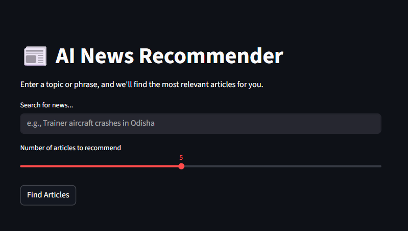
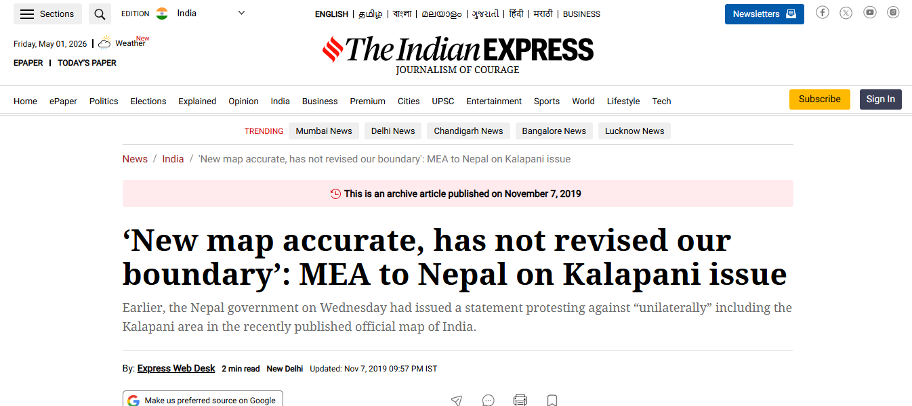

# 📰 AI News Recommender

It is an AI-powered news recommendation tool that helps users discover relevant news articles based on their interests. The project uses **Natural Language Processing (NLP)** to analyze articles from *The Indian Express* and recommends the most similar stories using text preprocessing, vectorization, and cosine similarity.

## 📁 Project Structure

```text
AI_News_Recommender/
│
├── screenshots/              # UI demo images
├── .gitignore                 # Files to exclude from Git
├── README.md                  # Project documentation
├── indian_news_article.ipynb  # Notebook to train model & export pickle files
├── requirements.txt           # Python dependencies
└── streamlit_app.py           # Streamlit Web App (Main Entry Point)
```
## 🖼️ Project Demo

### 1. Default View

*The initial state of the application.*
-------------------------------------------------------------------------------------------------------

### 2. Searching for Articles

*Inputting a query into the search bar.*
------------------------------------------------------------------------------------------------------

### 3. Recommendations

*Top articles with relevance scores.*
-------------------------------------------------------------------------------------------------------

### 4. Source Redirection
 
---

*Redirecting to the official Indian Express site.*

---

## 🛠️ Setup and Installation

### 1. Clone the Repository

```bash
git clone https://github.com/shashwatpokharel27-dotcom/AI_News_Recommender.git
cd AI_News_Recommender
```

### 2. Environment Setup

```bash
python -m venv myenv
```

#### On Windows

```bash
myenv\Scripts\activate
```

#### On Mac/Linux

```bash
source myenv/bin/activate
```

$1

## 📊 Dataset & Setup

Due to GitHub's file size limits, the raw dataset is not stored directly in this repository.

1. **Download the Dataset:** [Click here to download News_Articles_Indian_Express.csv](https://drive.google.com/file/d/1UORa4sRzpAc-eSfUSGoh_yc3g-C6Qplx/view?usp=drive_link)
2. **Location:** Place the downloaded `.csv` file inside the `notebooks/project/` folder.
3. **Train the Model:** Run all cells in `indian_news_article.ipynb`.

---

## 🧠 Workflow: Generating Required Files

Before running the Streamlit application, you must generate the processed data and vector files.

1. Open and run **`indian_news_article.ipynb`**.
2. This notebook performs the following:

   * Loads the raw CSV dataset.
   * Cleans and preprocesses the news text.
   * Trains the recommendation pipeline using **CountVectorizer** and **Cosine Similarity**.
   * **Exports:**

     * `articles.pkl` (Processed dataframe)
     * `cv.pkl` (The Vectorizer)
     * `vector.pkl` (The pre-calculated text vectors)
3. Make sure these generated files are placed where `streamlit_app.py` expects them.

---

## 🚀 Running the Application

Once the `.pkl` files are generated, start the web app:

```bash
streamlit run streamlit_app.py
```

Open your browser and navigate to `http://127.0.0.1:8501` to use the recommender.

---

## 🌟 Key Features

* **Content-Based Filtering:** Recommends articles based on similarity between the user query and news content.
* **Text Processing Pipeline:** Uses Regex cleaning and NLTK stemming for better text matching.
* **Efficient Vectorization:** Converts text into numerical vectors using `CountVectorizer`.
* **Similarity-Based Ranking:** Uses **Cosine Similarity** to rank the best-matching news articles.
* **Interactive UI:** Built with Streamlit for a simple and user-friendly experience.

---

## 🛠️ Tech Stack

* **Language:** Python 3.13
* **Data Science Libraries:** Pandas, NumPy, Scikit-learn, NLTK, Joblib
* **Web Framework:** Streamlit
* **Model Serialization:** Pickle

---

## 📌 Notes

* The dataset is not included in the repository because of its size.
* Make sure the `.pkl` files are generated before running the app.
* Check the file paths if you move the project folder to another location.

---

*Helping readers discover relevant news faster with NLP and machine learning.*


## 👤 Author

**Shashwat Pokharel**

- 📧 Email:shashwatpokharel27@gmail.com  
- 🔗 GitHub: https://github.com/shashwatpokharel27-dotcom  
- 💼 LinkedIn: https:/www.linkedin.com/in/shashwat-pokharel/ 
```

